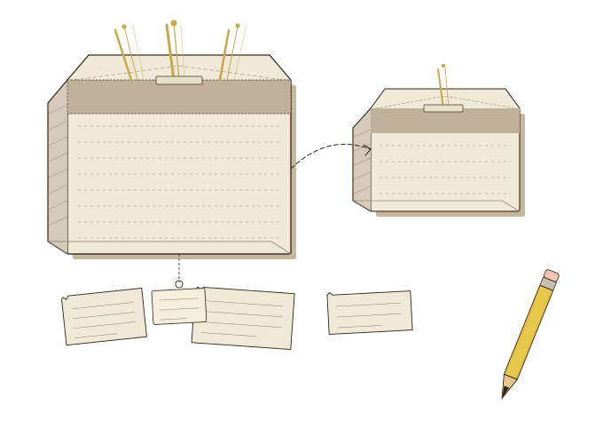

[](https://packagist.org/packages/schenke-io/test-output-formatter)
[](https://packagist.org/packages/schenke-io/test-output-formatter)
[](https://github.com/schenke-io/test-output-formatter/actions/workflows/tests.yml)
[](https://github.com/schenke-io/test-output-formatter/blob/main/LICENSE.md)
[](https://packagist.org/packages/schenke-io/test-output-formatter)

<!--
********************************************************************************
*                                                                              *
*     DO NOT EDIT THIS FILE MANUALLY! IT WILL BE OVERWRITTEN.                  *
*                                                                              *
*  This file was generated by:                                                 *
*  .make-markdown.php
*  Source files are located in: resources/md
*                                                                              *
*     If you want to change the content, edit the source files instead.        *
*                                                                              *
********************************************************************************
-->
# <a name="test-output-formatter"></a>Test Output Formatter

Isolates failing test files and under-coverage classes for rapid triage.

### <a name="benefits-for-ai-and-triage"></a>Benefits for AI and Triage

- **Token Efficiency**: Minimizes output to only what's necessary, saving tokens and reducing noise in AI-driven workflows.
- **Rapid Triage**: Focuses attention on the 1% of files that actually need fixing, speeding up the development cycle.

* [Test Output Formatter](#test-output-formatter)
    * [Benefits for AI and Triage](#benefits-for-ai-and-triage)
  * [Installation](#installation)
    * [Auto-Registration](#auto-registration)
  * [Features](#features)
    * [PHPStan](#phpstan)
    * [Pest](#pest)
    * [ErrorFormatter](#errorformatter)
      * [Public methods of ErrorFormatter](#public-methods-of-errorformatter)

## <a name="installation"></a>Installation

```bash
composer require --dev schenke-io/test-output-formatter
```

### <a name="auto-registration"></a>Auto-Registration

The package uses standard discovery mechanisms to integrate with your tools:

- **PHPStan**: The extension is automatically registered via the `phpstan-extension` type in `composer.json` and the `extension.neon` file. For this to work seamlessly, it is highly recommended to install the extension installer:

```bash
composer require --dev phpstan/extension-installer
```

- **Pest**: The plugin is automatically registered through the `extra.pest.plugins` configuration in `composer.json`. No additional configuration is required.

## <a name="features"></a>Features

### <a name="phpstan"></a>PHPStan

- **Error Formatter**: Output only file paths with errors for quick consumption by other tools.
- **Usage**:
  ```bash
  vendor/bin/phpstan analyse --error-format=testOutput
  ```

### <a name="pest"></a>Pest

- **Integration**: Plugin to assist in isolating failing tests and checking coverage.
- **Usage**:
  - **Failures only**: Just gives you the list of failing test files.
    ```bash
    vendor/bin/pest --parallel --failed-files-only
    ```
  - **Coverage check**: Reports classes with line coverage below the specified threshold.
    ```bash
    vendor/bin/pest --parallel --under=80
    ```

### <a name="errorformatter"></a>ErrorFormatter


#### <a name="public-methods-of-errorformatter"></a>Public methods of ErrorFormatter

| method       | summary                                             |
|--------------|-----------------------------------------------------|
| formatErrors | Formats the errors and outputs them to the console. |


---

Markdown file generated by [schenke-io/packaging-tools](https://github.com/schenke-io/packaging-tools)
